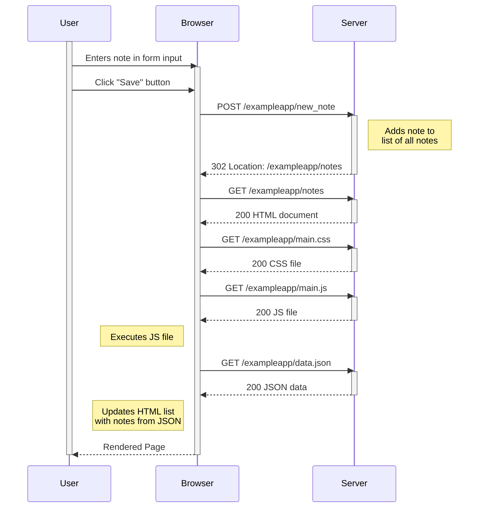

**Exercise 0.4**

Sequence diagram of submitting a new note on [https://studies.cs.helsinki.fi/](https://studies.cs.helsinki.fi/exampleapp/notes)

Assumes page is alreaded loaded and no client-side caching.

