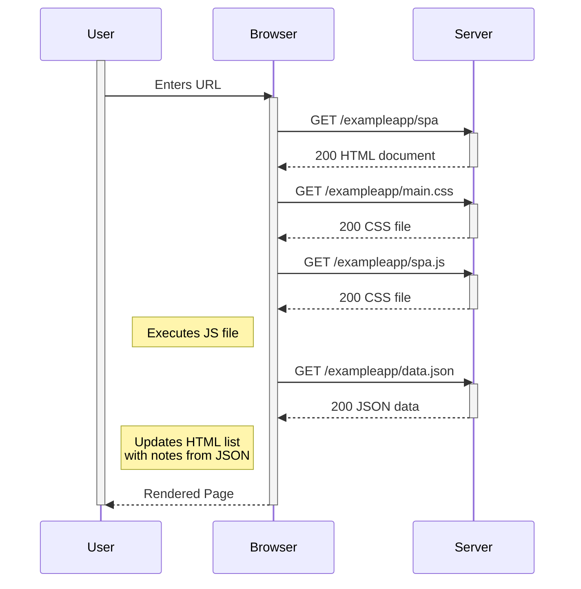

**Exercise 0.5**

Sequence diagram of loading [https://studies.cs.helsinki.fi/exampleapp/spa](https://studies.cs.helsinki.fi/exampleapp/spa)

Assumes no client-side caching.

```mermaid
sequenceDiagram

    participant User
    participant Browser
    participant Server 

    activate User
    User ->> Browser: Enters URL
    activate Browser

    Browser ->> Server: GET /exampleapp/spa
    activate Server
    Server -->> Browser: 200 HTML document
    deactivate Server

    Browser ->> Server: GET /exampleapp/main.css
    activate Server
    Server -->> Browser: 200 CSS file
    deactivate Server

    Browser ->> Server: GET /exampleapp/spa.js
    activate Server
    Server -->> Browser: 200 CSS file
    deactivate Server

    Note left of Browser: Executes JS file

    Browser ->> Server: GET /exampleapp/data.json
    activate Server
    Server -->> Browser: 200 JSON data
    deactivate Server

    Note left of Browser: Updates HTML list<br/> with notes from JSON

    Browser -->> User: Rendered Page
    deactivate Browser
    deactivate User

```