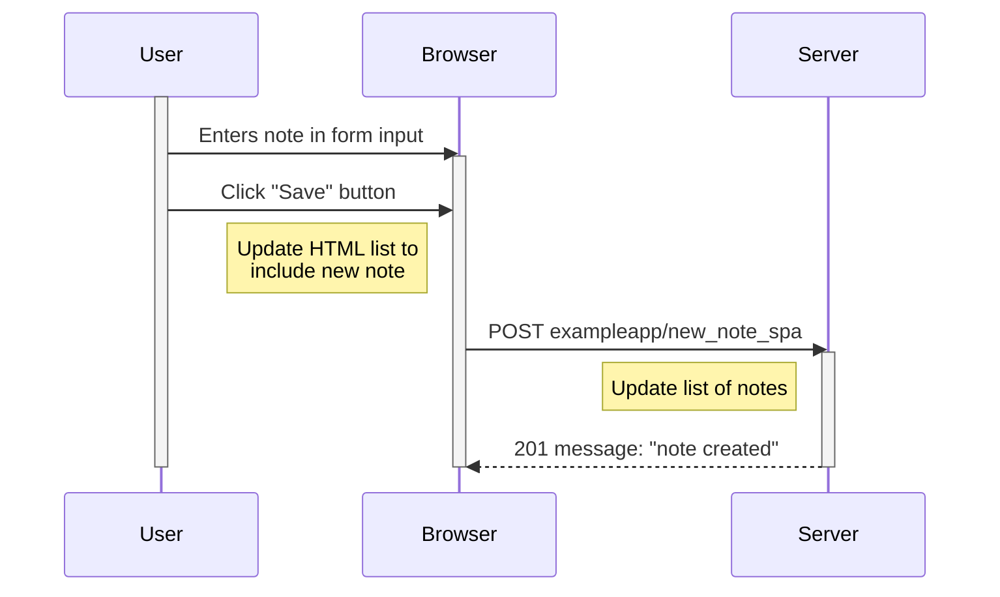

**Exercise 0.6**

Sequence diagram of submitting a note to [https://studies.cs.helsinki.fi/exampleapp/spa](https://studies.cs.helsinki.fi/exampleapp/spa)

Assumes application is already loaded and no client-side caching.

